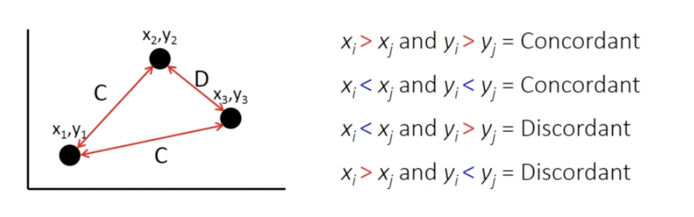

<style>
body {
text-align: justify}
</style>

```{r setup, include=FALSE}
knitr::opts_chunk$set(fig.width=10, fig.height=6,echo = TRUE, message = FALSE, warning = FALSE)
```

```{r libraries, echo=FALSE}
library(tidyverse)
library(dplyr)
library(corrplot)
library(lubridate)
library(ggplot2)
library(moderndive)
library(knitr)
library(shiny)
library(plotly)
```

## Dataset description:
The dataset includes several months of data on daily trending YouTube videos. The data is captured in the USA and is stored in a csv file. The Column data includes: 


Columns                    |   Data Type                          
---------------------------|----------------
1.  video_id               | String
2.	trending_date          | Date
3.	title                  | String
4.	channel_title          | String
5.	category_id            | Integer
6.	publish_time           | Date
7.	tags                   | String
8.	views                  | Integer
9.	likes                  | Integer
10.	dislikes               | Integer
11.	comment_count          | Integer
12. thumbnail_link         | String
13. comments_disabled      | Boolean
14.	ratings_disable        | Boolean
15. video_error_or_removed | Boolean
16. description            | String

Table: Dataset Description

## Purpose of the project: 
Vloggers on YouTube are provided with visual analytics on the content they upload by default, but they do not get the overall visualization of their competitor. Analyzing trending videos may provide publishers with the ability to predict the trend. Thus, they can develop their future content based on the analysis. Our analysis provides market forecast and intelligence which reveals information on the viewership, likes and dislikes. This prediction is based on many parameters and knowledge that our models have acquired by analyzing most trended videos that have been uploaded on YouTube. So, this can be extremely useful and profitable for YouTube channels who depend on their channels as a source of income.

## Intended audience:
We assume the audience of this report to know the basics of:

1.	R programming language
2.	Algebra
3.	Statistics.

## Importing and tidying the data:
The data is being imported using the read.csv() function. Although this is slower compared to the read_csv(), it is important that the integrity and the proper structure of data be maintained. A single function has been constructed which handles the data import and tidying. It can be seen below: 
```{r tidying_data, echo=FALSE}

# Function to tidy the data sets
tidy_dataset <- function(file_name)
{
  #---- Reading the data
  path <- paste('data/',file_name,sep='')
  mydata <- read.csv(path, stringsAsFactors = FALSE)
  
  #---- Tidying the data
  
  #Changing the format of Trending Date to a readable format
  mydata$trending_date <- as.Date(mydata$trending_date, format = "%y.%d.%m")
  #Adding a column called days of the week to the data starting Sunday
  mydata$dayOfWeek <- wday(as.Date(mydata$trending_date, format = "%y.%d.%m"))
  #Editing the date to have only the month
  mydata$trending_date <- format(as.Date(mydata$trending_date), "%m")
  #Changing the date to a factor type
  mydata$trending_date <- as.factor(mydata$trending_date)
  #Changing the format of Trending Date to a readable format
  mydata$publish_time <- substr(mydata$publish_time, 0, 10)
  mydata$publish_time <- as.Date(mydata$publish_time, format = "%Y-%m-%d")
  #Editing the date to have only the month
  mydata$publish_time <- format(as.Date(mydata$publish_time), "%m")
  #Changing the date to a factor type
  mydata$publish_time <- as.factor(mydata$publish_time)

  #Changing column names of trending_date and publish_time
  names(mydata)[2] <- "trending_month" 
  names(mydata)[6] <- "publish_month" 
  
  #Getting rid of unnecessary variables
  d_subset <- mydata[,c(2,3,4,5,6,7,8,9,10,11,13,14,15,16,17)]
  
  #If the video has no tags or if the video has no description, omitting it
  new_dataset <- d_subset[d_subset$tags != '[none]', ]
  new_dataset <- new_dataset[new_dataset$description != '', ]
  
  #---- Creating New Dataset
  newfile = paste('tidydata/new',file_name,sep='')
  write.csv(new_dataset, newfile, row.names = FALSE)
}
#Calling the function to tidy the dataset and obtain a tidy csv file
tidy_dataset("USvideos.csv")
```
The code above shows the function used to import and clean data. After the data is imported, the data is tidied. The process followed for tidying the data is as follows:

1. The date is processed so that it is in a readable format. And, only the required component of the date which is the month and days of week are selected.i.e. The variable trending_date and publish_time are cleaned to obtain the respective month.
2. The same process is repeated for both, trending_date and publish_time.
3. These variables are changed to a factor type to help in further analysis.
4. Two new variables are created which are basically containing the values of publish_time and trending_date. But, now, they are renamed to publish_month and trending_month respectively.
5. Then, the videos unnecessary to our project, i.e., the  ones with no tags or no description are being omitted for the sake of convenience. This will not have a big impact on the analysis because most of them are outliers and losing them does not affect the analysis greatly.

Then, a new csv file is generated by using the write.csv() function. The new file is renamed as the same name as the input file, but with the a ‘new’ appended at the beginning of the filename. So, a new csv file containing the tidied data is generated once the function is called. The input to a function is a file. Eg: tidy_dataset(CAvideos.csv). So, once this function is called, the CAvideos.csv is tidied and another file called newCAvideos.csv is generated. This holds the tidied data. After the data is tidied, the structure of the data frame is as follows:


Columns                    |   Data Type                  
---------------------------|----------------
1.	trending_month         | Factor
2.	title                  | String
3.	channel_title          | String
4.	category_id            | Integer
5.	publish_month          | Factor
6.	tags                   | String
7.	views                  | Integer
8.	likes                  | Integer
9.	dislikes               | Integer
10.	comment_count          | Integer
11. comments_disabled      | String
12.	ratings_disable        | String
13. video_error_or_removed | String
14. description            | String
15. day_of_week            | Factor

Table: Tidy Data Description

\  

\  

\  

\  

\  

\  

\  

\  

\  

\  
 

## Exploratory data analysis:
Exploratory Data Analysis is the critical process of performing initial investigations on the obtained data in order to build hypotheses, expose anomalies present and check assumptions.


```{r eda, echo=FALSE}
# Exploratory Data Analysis
# Reading contents from the tidied dataset
tidy_data_csv <- read.csv('tidydata/newUSvideos.csv', stringsAsFactors = F)
tidy_data_csv[,c("trending_month","publish_month")] <- lapply(
  tidy_data_csv[,
            c(
              "trending_month",
              "publish_month"
              )
            ],as.factor)
# Separating integers type variable from the dataset from the rest of the table
tidy_data_integer <- data.frame(tidy_data_csv$views, 
                                tidy_data_csv$likes,
                                tidy_data_csv$dislikes, 
                                tidy_data_csv$comment_count)
# Renaming the columns created in the previous dataframe.
names(tidy_data_integer) <- c("Views\n", 
                              "Likes\n", 
                              "Dislikes\n", 
                              "Comment Count\n")
```

### Study of distribution of variables in the dataset:

#### Density plot:

```{r density_plot, echo=FALSE, fig.height=5}
# Density Plot
(
  # Density Plot for Views
  density_plot_views <- tidy_data_csv %>%
  ggplot(
    aes(
      x = log(views)
        )
    ) +
  geom_density(bw = 1)+
    ggtitle("Density Plot for Views")+
    theme(axis.title.y = element_text(angle = 0, vjust = 0.5))
)
(
  # Density Plot for likes
  density_plot_likes <- tidy_data_csv %>%
    ggplot(
      aes(
        x = log(likes)
      )
    ) +
    geom_density(
      bw = 1
    ) +
    ggtitle("Density Plot for likes")+
    theme(axis.title.y = element_text(angle = 0, vjust = 0.5))
)
(
  # Density Plot for dislikes
  density_plot_dislikes <- tidy_data_csv %>%
    ggplot(
      aes(
        x = log(dislikes)
      )
    ) +
    geom_density(
      bw = 1
    )+
    ggtitle("Density Plot for dislikes")+
    theme(axis.title.y = element_text(angle = 0, vjust = 0.5))
)
(
  # Density Plot for comment_count
  density_plot_comment <- tidy_data_csv %>%
    ggplot(
      aes(
        x = log(comment_count)
      )
    )+
    xlab("log(Comment Count)")+
    geom_density(
      bw = 1
    )+
    ggtitle("Density Plot for comment count")+
    theme(axis.title.y = element_text(angle = 0, vjust = 0.5))
)
```

From the Density plots, we conclude that all the continuous variables follow the normal distribution.
This brings us to the next step for verifying correlation whether it is valid or spurious. We term a correlation is Spurious when the correlation matrix shows a strong correlation coefficient, but the scatterplot does not show any possible linear curve fit. 
We perform this step, in order to eliminate spurious correlations. In this step we draw scatter plots to the strong and moderately correlated variable pairs. 

\  

\  

\  

\  

\  

#### Scatter plot:

```{r scatter_plot, echo=FALSE}
#Scatter Plot
# Scatter Plot for likes vs. views
(
  scatter_likes_views <- tidy_data_csv %>%
    ggplot(
      aes(
        x = log(views),
        y = log(likes)
      )
    ) +
    geom_point()+
    ggtitle("Scatter Plot for likes vs. views")+
    theme(axis.title.y = element_text(angle = 0, vjust = 0.5))
)
# Scatter Plot for comment_count vs. likes
(
 scatter_comment_likes <- tidy_data_csv %>%
    ggplot(
      aes(
        x = log(likes),
        y = log(comment_count)
      )
      
    ) +
    ylab("log(Comment Count)")+
    geom_point()+
    ggtitle("Scatter Plot for comment count vs. likes") +
    theme(axis.title.y = element_text(angle = 0, vjust = 0.5))
)
# Scatter Plot for comment_count vs. dislikes 
(
 scatter_com_dis <- tidy_data_csv %>%
    ggplot(
      aes(
        x = log(dislikes),
        y = log(comment_count)
      )
    ) +
    ylab("log(Comment Count)")+
    geom_point()+
    ggtitle("Scatter Plot for comment count vs. dislikes")+
    theme(axis.title.y = element_text(angle = 0, vjust = 0.5))
)
# Scatter Plot for views vs. comment_count
(
 scatter_view_com <- tidy_data_csv %>%
    ggplot(
      aes(
        x = log(views),
        y = log(comment_count)
      )
    ) +
    ylab("log(Comment Count)")+
    geom_point()+
    ggtitle("Scatter Plot for views vs. comment count") +
    theme(axis.title.y = element_text(angle = 0, vjust = 0.5))
)
# Scatter Plot for publish_month vs trending_month
(
 scatter_pub_trend <- tidy_data_csv %>%
    ggplot(
      aes(
        x = publish_month,
        y = trending_month
      )
    ) +
    ylab("Trending Month")+xlab("Publish Month")+
    geom_point()+
    ggtitle("Scatter Plot for publish month vs trending month") +
    theme(axis.title.y = element_text(angle = 0, vjust = 0.5))
)
```

From the Scatter plots, we conclude that all the selected variable pairs are not spurious. 
Now that we have proven that the correlation is not spurious, we go ahead to assume that the relationship is valid.

As a result of Exploratory Data Analysis, we will know the following:

1.	Correlation map for the variables present in the dataset
2.	Initial graphical visualizations

### Correlation study:

#### Correlation definition:

Correlation is the bivariate (two variable) analysis that measures the strength of association between two variables. It is also used to determine the direction of the association. The strength of the association is expressed by the correlation coefficient, whose value varies between -1 and +1. A value of +1 indicates a strong positive correlation, a value of -1 indicates a strong negative correlation and a value of 0 indicates there is no correlation. Positive correlation meaning the value of the response variable tends to change in the same direction for every change in the explanatory variable. Negative correlation meaning value of the response variable tends to change in the opposite direction for every change in the explanatory variable. The closer the coefficient value is to zero the weaker the strength of correlation. 

#### Reasons for performing correlation analysis:
We perform Correlation analysis in order to determine the strength of association between variables in the dataset. By doing so we will be able to know the potential attributes about each variable.

Correlation is strictly used to test association between variables, it does not make any assumptions whether one variable dependent on the other. 

#### Different types of correlations:

In  [1] it is given that, the three types of correlation are:

1. Pearson Product Moment Correlation
2. Spearman Rank Correlation
3. Kendall Rank Correlation


##### Pearson correlation:
It is a technique used to measure two quantitative and continuous variables^2^.

##### Spearman rank correlation:
It is a technique used when we need to measure correlation between two ranked variables or when  we want to measure the correlation between a quantitative variable and a ranked variable^3^.

##### Kendall rank correlation:
It is a technique used when we need to measure the correlation between pairs of bivariate points; the co-ordinates are measured individually to declare each point in the graph as concordant or discordant with respect to the other points on the graph. 

Example: 



\  

\  

\  

\  

\  

\  

\  

\  

\  

\  

\  

#### Applications of correlation in our project:

##### Pearson correlation graphical map:
 

```{r pearson, echo=FALSE, fig.height=4}
# Plotting Pearson Correlation graphical map
par(xpd=TRUE)#To allow labels to be printed within the margin areas.
correlation_data_pearson <- tidy_data_integer %>%
  cor() %>%
  corrplot(
    method = "color",
    type = "upper", order = "hclust", number.cex = 1,
    addCoef.col = "black", # Add coefficient of correlation
    tl.col = "black", tl.srt = 0, # Text label color and rotation
    #Specifying margins
    mar = c(2, 0, 1, 0),
    # hide correlation coefficient on the principal diagonal
    diag = FALSE
    )
```

From the Pearson Correlation map, it is clear that, 

1.	Views and likes
2.	Comment count and likes 

These are strongly correlated with a coefficient value of 0.85 and 0.85 respectively. Following which,

1.	Comment count and dislikes 
2.	Comment count and views
These pairs moderately correlated with a coefficient value of 0.62 and 0.66 respectively.

While we find the remaining pairs are also positively correlated, we ignore the correlation because the value of the remaining pairs relative to the above four pairs are weakly correlated.


##### Spearman correlation map:


```{r spearman, echo=FALSE, fig.height=3}
#Creating a data frame for calculating Spearman Correlation Map
trended_month <- as.integer(tidy_data_csv$trending_month)
published_month <- as.integer(tidy_data_csv$publish_month)
ordinal_data_frame <- data.frame(trended_month,published_month)
# Renaming the columns created in the previous dataframe.
names(ordinal_data_frame) <- c("Trended Month\n", 
                              "Published Month\n")

#Plotting Spearman Correlation graphical map
par(xpd=TRUE)#To allow labels to be printed within the margin areas.
correlation_data_spearman <- ordinal_data_frame %>%
  cor(
    method = "spearman",
    use = "pairwise.complete.obs") %>%
  corrplot(
    method = "color",
    type = "upper", order = "hclust", number.cex = 1,
    # Add coefficient of correlation
    addCoef.col = "black",
    # Text label color and rotation
    tl.srt = 0,tl.col = "black", 
    # hide correlation coefficient on the principal diagonal
    diag = FALSE,
    #Specifying margins
    mar = c(2, 0, 1, 0)
  )
```

From the Spearman Correlation map, it is clear that,
Trending month and Published month are highly correlated, with a Coefficient value of 0.88.

	
## Hypothesis definition, analysis, testing and model selection:

**Hypothesis 1:**

### Predict the number of likes for a trending video in the dataset.


```{r summary_statistics_hyp1, echo=FALSE, fig.height=4.1}
# Claculating mean, median and standard deviation of response variable.
summary_statistics_likes <- tidy_data_csv %>%
  summarise(
            mean_likes = mean(likes), 
            median_likes = median(likes), 
            sd_likes = sd(likes)
            )
names(summary_statistics_likes) <- c("mean likes", "median likes", "standard deviation of likes")
knitr::kable(summary_statistics_likes, caption = "Hypothesis 1 Summary Statistics")
# Checking the distribution of response variable.
ggplot(tidy_data_csv, aes(x = likes)) +
  geom_histogram()+
    ggtitle("Likes Histogram")+
    theme(axis.title.y = element_text(angle = 0, vjust = 0.5))
# Taking natural log. Since log10 or log or log2 gives infinity for observations containing zero, I have htaken log1p i.e log(1 + x), keeps value calculatable, as log is monotonic, the ordering is preserved. |x| << 1.
tidy_data_csv_log1p <- tidy_data_csv %>%
    mutate(log1p_likes = log1p(likes),
           log1p_views = log1p(views),
           log1p_comment_count = log1p(comment_count))
# Checking distribution after taking log1p.
ggplot(tidy_data_csv_log1p, aes(x = log1p_likes)) +
  geom_histogram()+
  xlab("log1p(likes)")+
    ggtitle("log1p(Likes) Histogram")+
    theme(axis.title.y = element_text(angle = 0, vjust = 0.5))
```

Taking natural log, Since log10 or log or log2 gives infinity for observations containing zero, we have taken log1p i.e log(1 + x), this keeps the value calculatable, as log is monotonic, the ordering is preserved. |x| << 1.


```{r hypothesis_1, echo=FALSE}
# Performing 2-fold test to divide the data into training and testing, This is done by randomly assigning
# True and False to the observations and dividing them later as shown in the code. 
# Observations that are assigned True - Training data; False - Testing data.
tidy_data_csv_log1p$training_cases <- rnorm(nrow(tidy_data_csv_log1p)) > 0
# Fitting linear regression model on training data.
linear_model_likes_1 <- lm(log1p_likes ~ log1p_comment_count + log1p_views, data = subset(tidy_data_csv_log1p, training_cases))
# get_regression_points() is a function in the moderndive package, it is a tibble-formatted regression table of outcome/response variable, all explanatory/predictor variables, the fitted/predicted value, and residual.

# Displaying fitted linear model for training data
likes_regression_points_1_training <-  get_regression_points(linear_model_likes_1)

# Performing prediction on testing data set.
likes_regression_points_1_testing <- get_regression_points(linear_model_likes_1, newdata = subset(tidy_data_csv_log1p, !training_cases)) 

# The information on residual is calculated for the testing data set. The information meaning -
# sq_residual -> Residual square
# sum_sq_residual -> sum of all Residual square
# mse -> mean of Residual square (also known as mean squared error)
# rmse -> square root of mean squared error
# r_squared -> r squared. 
likes_residual_statistics_testing <- likes_regression_points_1_testing %>%
  mutate(sq_residuals = residual^2) %>%
  summarize(sum_sq_residuals = sum(sq_residuals), mse = mean(sq_residuals), rmse = sqrt(mse), r_squared = 1 - var(residual) / var(log1p_likes))

# # The information on residual is calculated for the training data set. The information meaning -
# sq_residual -> Residual square
# sum_sq_residual -> sum of all Residual square
# mse -> mean of Residual square (also known as mean squared error)
# rmse -> square root of mean squared error
# r_squared -> r squared.
likes_residual_statistics_training <- likes_regression_points_1_training %>%
  mutate(sq_residuals = residual^2) %>%
  summarize(sum_sq_residuals = sum(sq_residuals), mse = mean(sq_residuals), rmse = sqrt(mse), r_squared = 1 - var(residual) / var(log1p_likes))

# The distribution of the residual is checked for testing dataset
residual_stats_testing_hyp1 <- ggplot(likes_regression_points_1_testing, aes(x = log10(residual))) +
  geom_histogram() +
  labs(x = "residuals", title = "Residuals from the linear model with formula log1p(likes) ~ log1p(comment count) + log1p(views) on testing dataset")+
    ggtitle("Likes Histogram")
# The distribution of the residual is checked for training dataset
residual_stats_training_hyp1 <- ggplot(likes_regression_points_1_training, aes(x = log10(residual))) +
  geom_histogram() +
  labs(x = "residuals", title = "Residuals from the linear model with formula log1p(likes) ~ log1p(comment count) + log1p(views) on training dataset")
```


The high R squared value explains that the prediction is accurate up to 81.4% of the time. We arrive at this value because, the closer the R squared value is to 1.0, the closer it is to being perfectly accurate. There are many parameters to assess the model, we've chosen to go ahead with R squared method.
To make sure that the model is unbiased, we have considered accuracy of the model when the testing dataset is used.


**Hypothesis 2:**

### Predict the number of dislikes for a trending video in the dataset.

```{r summary_statistics_hyp2, echo=FALSE, fig.height=4.3}
# Claculating mean, median and standard deviation of response variable.
summary_statistics_dislikes <- tidy_data_csv %>%
  summarise(
            mean_dislikes = mean(dislikes), 
            median_dislikes = median(dislikes), 
            sd_dislikes = sd(dislikes)
            )
names(summary_statistics_dislikes) <- c("mean dislikes", "median dislikes", "standard deviation of dislikes")
knitr::kable(summary_statistics_dislikes, caption = "Hypothesis 2 Summary Statistics")
# Checking the distribution of response variable.
ggplot(tidy_data_csv, aes(x = dislikes)) +
  geom_histogram()+
    ggtitle("Dislikes Histogram")+
    theme(axis.title.y = element_text(angle = 0, vjust = 0.5))
# Taking natural log. Since log10 or log or log2 gives infinity for observations containing zero, I have htaken log1p i.e log(1 + x), keeps value calculatable, as log is monotonic, the ordering is preserved. |x| << 1.
tidy_data_csv_log1p <- tidy_data_csv %>%
    mutate(log1p_dislikes = log1p(dislikes),
           log1p_views = log1p(views),
           log1p_comment_count = log1p(comment_count))
# Checking distribution after taking log1p.
ggplot(tidy_data_csv_log1p, aes(x = log1p_dislikes)) +
  geom_histogram()+
  xlab("log1p(dislikes)")+
    ggtitle("log1p(Dislikes) Histogram")+
    theme(axis.title.y = element_text(angle = 0, vjust = 0.5))
```


Taking natural log, Since log10 or log or log2 gives infinity for observations containing zero, we have taken log1p i.e log(1 + x), this keeps the value calculatable, as log is monotonic, the ordering is preserved. |x| << 1.


```{r hypothesis_2, echo=FALSE}
# Performing 2-fold test to divide the data into training and testing, This is done by randomly assigning
# True and False to the observations and dividing them later as shown in the code. 
# Observations that are assigned True - Training data; False - Testing data.
tidy_data_csv_log1p$training_cases <- rnorm(nrow(tidy_data_csv_log1p)) > 0
# Fitting linear regression model on training data.
linear_model_dislikes_2 <- lm(log1p_dislikes ~ log1p_comment_count + log1p_views, data = subset(tidy_data_csv_log1p, training_cases))
# get_regression_points() is a function in the moderndive package, it is a tibble-formatted regression table of outcome/response variable, all explanatory/predictor variables, the fitted/predicted value, and residual.

# Displaying fitted linear model for training data
dislikes_regression_points_2_training <- get_regression_points(linear_model_dislikes_2) 

# Performing prediction on testing data set.
dislikes_regression_points_2_testing <- get_regression_points(linear_model_dislikes_2, newdata = subset(tidy_data_csv_log1p, !training_cases)) 

# The information on residual is calculated for the testing data set. The information meaning -
# sq_residual -> Residual square
# sum_sq_residual -> sum of all Residual square
# mse -> mean of Residual square (also known as mean squared error)
# rmse -> square root of mean squared error
# r_squared -> r squared. 
dislikes_residual_statistics_testing <- dislikes_regression_points_2_testing %>%
  mutate(sq_residuals = residual^2) %>%
  summarize(sum_sq_residuals = sum(sq_residuals), mse = mean(sq_residuals), rmse = sqrt(mse), r_squared = 1 - var(residual) / var(log1p_dislikes))

# The information on residual is calculated for the training data set. The information meaning -
# sq_residual -> Residual square
# sum_sq_residual -> sum of all Residual square
# mse -> mean of Residual square (also known as mean squared error)
# rmse -> square root of mean squared error
# r_squared -> r squared. 
dislikes_residual_statistics_training <- dislikes_regression_points_2_training %>%
  mutate(sq_residuals = residual^2) %>%
  summarize(sum_sq_residuals = sum(sq_residuals), mse = mean(sq_residuals), rmse = sqrt(mse), r_squared = 1 - var(residual) / var(log1p_dislikes))

# The distribution of the residual is checked testing dataset
residual_stats_testing_hyp2 <- ggplot(dislikes_regression_points_2_testing, aes(x = log10(residual))) +
  geom_histogram() +
  labs(x = "residuals", title = "Residuals from the linear model with formula log1p(dislikes) ~ log1p(comment count) + log1p(views)")


# The distribution of the residual is checked training dataset
residual_stats_training_hyp2 <- ggplot(dislikes_regression_points_2_training, aes(x = log10(residual))) +
  geom_histogram() +
  labs(x = "residuals", title = "Residuals from the linear model with formula log1p(dislikes) ~ log1p(comment count) + log1p(views)")
```


The high R squared value explains that the prediction is accurate up to 78.8% of the time. We arrive at this value because, the closer the R squared value is to 1.0, the closer it is to being perfectly accurate. There are many parameters to assess the model, we've chosen to go ahead with R squared method.
To make sure that the model is unbiased, we have considered accuracy of the model when the testing dataset is used.

\  

**Hypothesis 3:**

### Predict the number of comments for a trending video in the dataset.

```{r summary_statistics_hyp3, echo=FALSE, fig.height=4.3}
# Claculating mean, median and standard deviation of response variable.
summary_statistics_comment_count <- tidy_data_csv %>%
  summarise(
            mean_comment_count = mean(comment_count), 
            median_comment_count = median(comment_count), 
            sd_comment_count = sd(comment_count)
            )
names(summary_statistics_comment_count) <- c("mean comment count", "median comment count", "standard deviation of comment count")
knitr::kable(summary_statistics_comment_count, caption = "Hypothesis 3 Summary Statistics")
# Checking the distribution of response variable.
ggplot(tidy_data_csv, aes(x = comment_count)) +
  geom_histogram()+
  xlab("Comment Count")+
    ggtitle("Comment Count Histogram")+
    theme(axis.title.y = element_text(angle = 0, vjust = 0.5))
# Taking natural log. Since log10 or log or log2 gives infinity for observations containing zero, I have htaken log1p i.e log(1 + x), keeps value calculatable, as log is monotonic, the ordering is preserved. |x| << 1.
tidy_data_csv_log1p <- tidy_data_csv %>%
    mutate(log1p_likes = log1p(likes),
           log1p_views = log1p(views),
           log1p_comment_count = log1p(comment_count))
# Checking distribution after taking log1p.
ggplot(tidy_data_csv_log1p, aes(x = log1p_comment_count)) +
  geom_histogram()+
  xlab("log1p(Comment count)")+
    ggtitle("log1p(Comment Count) Histogram")+
    theme(axis.title.y = element_text(angle = 0, vjust = 0.5))
```


Taking natural log, Since log10 or log or log2 gives infinity for observations containing zero, we have taken log1p i.e log(1 + x), this keeps the value calculatable, as log is monotonic, the ordering is preserved. |x| << 1.


```{r hypothesis_3, echo=FALSE}
# Performing 2-fold test to divide the data into training and testing, This is done by randomly assigning
# True and False to the observations and dividing them later as shown in the code. 
# Observations that are assigned True - Training data; False - Testing data.

tidy_data_csv_log1p$training_cases <- rnorm(nrow(tidy_data_csv_log1p)) > 0

# Fitting linear regression model on training data.
linear_model_comment_count_3 <- lm(log1p_comment_count ~ log1p_likes + log1p_views, data = subset(tidy_data_csv_log1p, training_cases))

# get_regression_points() is a function in the moderndive package, it is a tibble-formatted regression table of outcome/response variable, all explanatory/predictor variables, the fitted/predicted value, and residual.

# Displaying fitted linear model for training data
comment_count_regression_points_3_training <- get_regression_points(linear_model_comment_count_3)

# Performing prediction on testing data set.
comment_count_regression_points_3_testing <- get_regression_points(linear_model_comment_count_3, newdata = subset(tidy_data_csv_log1p, !training_cases)) 

# The information on residual is calculated for the testing data set. The information meaning -
# sq_residual -> Residual square
# sum_sq_residual -> sum of all Residual square
# mse -> mean of Residual square (also known as mean squared error)
# rmse -> square root of mean squared error
# r_squared -> r squared. 

comment_count_residual_statistics_testing <- comment_count_regression_points_3_testing %>%
  mutate(sq_residuals = residual^2) %>%
  summarize(sum_sq_residuals = sum(sq_residuals), mse = mean(sq_residuals), rmse = sqrt(mse), r_squared = 1 - var(residual) / var(log1p_comment_count))

# The information on residual is calculated for the training data set. The information meaning -
# sq_residual -> Residual square
# sum_sq_residual -> sum of all Residual square
# mse -> mean of Residual square (also known as mean squared error)
# rmse -> square root of mean squared error
# r_squared -> r squared. 

comment_count_residual_statistics_training <- comment_count_regression_points_3_training %>%
  mutate(sq_residuals = residual^2) %>%
  summarize(sum_sq_residuals = sum(sq_residuals), mse = mean(sq_residuals), rmse = sqrt(mse), r_squared = 1 - var(residual) / var(log1p_comment_count))

# The distribution of the residual is checked testing dataset

residual_stats_testing_hyp3 <- ggplot(comment_count_regression_points_3_testing, aes(x = log10(residual))) +
  geom_histogram() +
  labs(x = "residuals", title = "Residuals from the linear model with formula log1p(comment count) ~ log1p(likes) + log1p(views)")

# The distribution of the residual is checked training dataset

residual_stats_training_hyp3 <- ggplot(comment_count_regression_points_3_training, aes(x = log10(residual))) +
  geom_histogram() +
  labs(x = "residuals", title = "Residuals from the linear model with formula log1p(comment count) ~ log1p(likes) + log1p(views)")
```


The high R squared value explains that the prediction is accurate up to 70.9% of the time. We arrive at this value because, the closer the R squared value is to 1.0, the closer it is to being perfectly accurate. There are many parameters to assess the model, we've chosen to go ahead with R squared method.
To make sure that the model is unbiased, we have considered accuracy of the model when the testing dataset is used.


### Reason for choosing the hypotheses:

As a result of Exploratory Data Analysis, we noticed that:

1. Views and likes
2. Comment count and likes
3. Comment count and dislikes
4. Comment count and views

Are strongly interdependent, however we make no assumption about the causal effect. The strong interdependence gives us an insight to further investigate to check the causality of this interdependence.

### Hypotheses test:

We follow K-Fold cross validation technique, as it is best suited for small datasets^5^.
(Please note that the following table has been modified to improve readability and to fit the table in a page)

```{r hypo_test, echo=FALSE}
#Removing unnecessary columns
test_data_sample <- tidy_data_csv_log1p[,c(2, 16, 17, 18, 19)]
#Renaming the columns
names(test_data_sample) <- c("Title", "log1p(likes)", "log1p(views)", "log1p(comment count)","Training Cases")
#Displaying necessary data
kable(head(test_data_sample, n=5), caption = "Hypothesis Test")
```

The data of this table contains the column "training_cases" which conveys whether the data is training or testing data. The data has been used in a 2-Fold cross validation technique which has boolean values under the column "training_cases". "TRUE" indicates training data and "FALSE" indicates testing data. This has been done so that the model is unbiased and overfitting is prevented.

### Reason and selection of model:

From the Pearson correlation map, we can conclude that there is strong interdependence on many continuous variables of the dataset. This tells us that there is a possibility of using simple linear regression because simple linear regression is useful for finding the relationship between two continuous variables in a dataset.

From the Spearman correlation map. It is evident that Trending date and Publish Date are strongly interdependent, however further investigation is required to help us predict this strong association.


## Challenges:

Due to the COVID-19, and one of our team members stuck in Boston we were not be able to meet. We needed to strategize our communication to adapt to this situation.

We needed to come up with a model for predicting the causal effect for the strong correlation between the trending month and publish month. We still need to investigate further in order to come up with more suitable hypotheses for the same.


## Conclusion:

We found this dataset on Kaggle.com and we came up with a novel approach of conveying the analysis by using shiny. The analysis predicts the number of likes, dislikes and comments. We learnt that we need to use linear regression depending on the scatter plot we visualize during the exploratory data analysis. We use a density plot to know the distribution of the response variables. We later introduced a correlation heat map. Although the idea of correlation coefficient matrix is not new, we found that most of the visualizations on correlation although informative, require a bit more effort to understand. We simplified it further to make it look more readable to the audience and attempted to increase the audience base for the analysis. To make it more interactive, we have used Shiny. This makes it easier for the user to use our model and interact in real time, by providing predictions in real time. Overall, we have made an attempt to make the information in our analysis more reproducible, redistributable and novel.


## References:

1. Kerley, Christa. "What Are the Different Types of Correlations?" sciencing.com, https://sciencing.com/different-types-correlations-6979655.html. March 25 2020.
2. University of the West of England, Pearson's Correlation Coefficient.
Retrieved March 25, 2020, from http://learntech.uwe.ac.uk/da/Default.aspx?pageid=1442.
3. McDonald, J.H. 2014. Handbook of Biological Statistics (3rd ed.). Sparky House Publishing, Baltimore, Maryland.
4. Clapham, Matthew. E. Jan 30, 2016, 19: Non-parametric correlation, Retrieved March 25, 2020, from https://www.youtube.com/watch?v=bAstMHbytK0
5. AS (2017). JMP 13 Fitting Linear Models, Second Edition.
